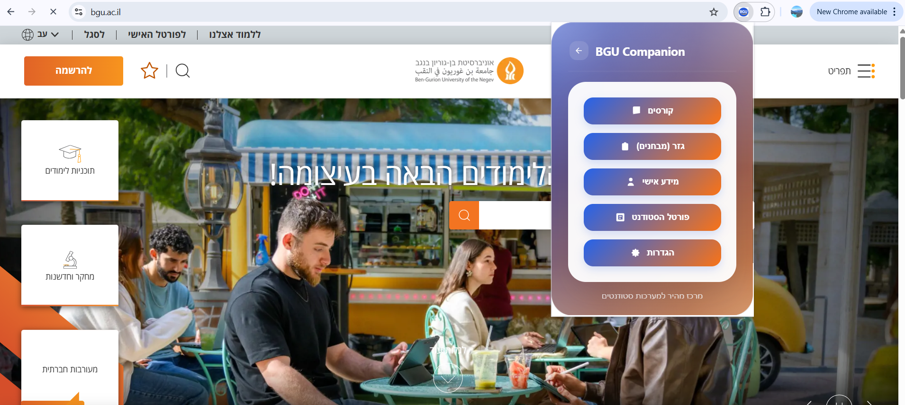
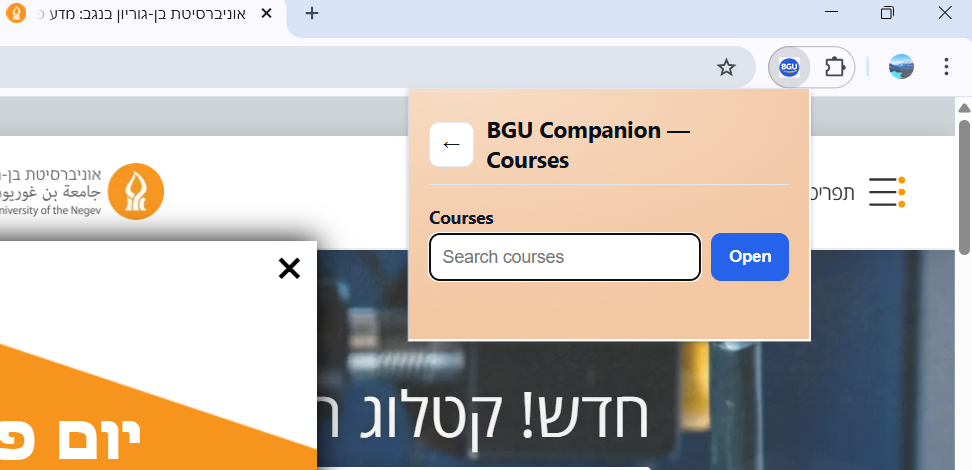
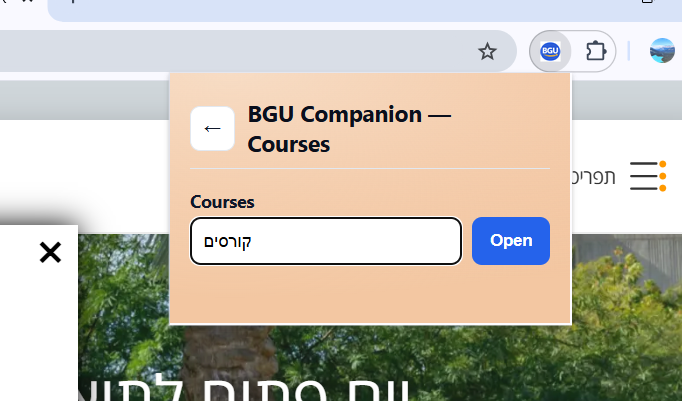
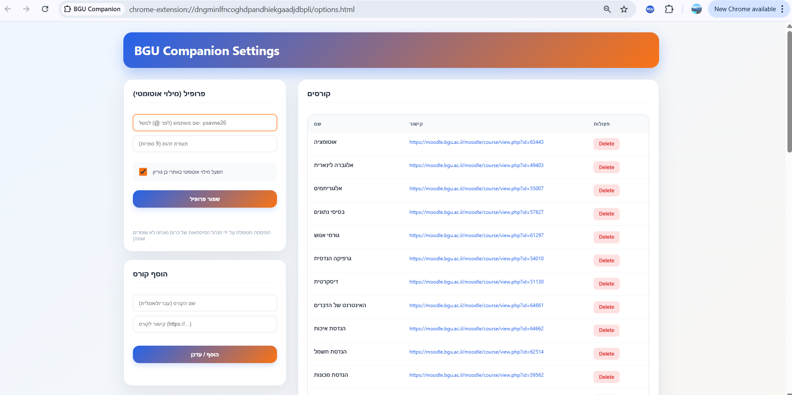
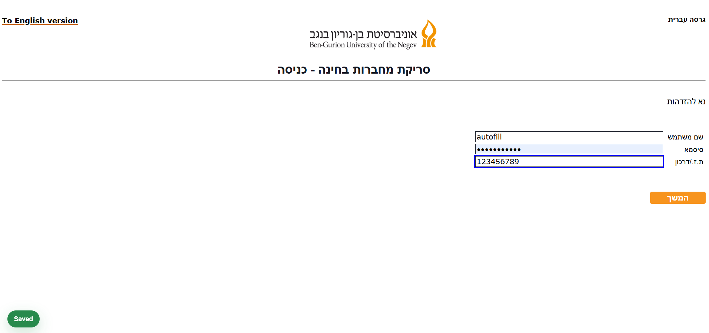
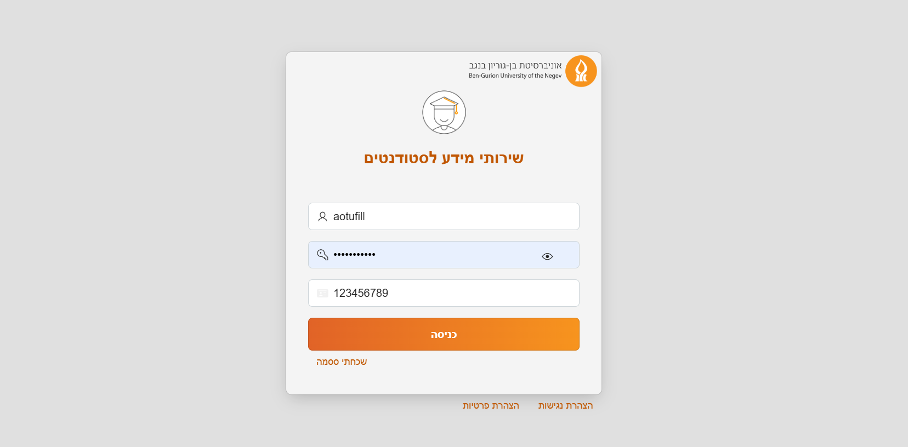
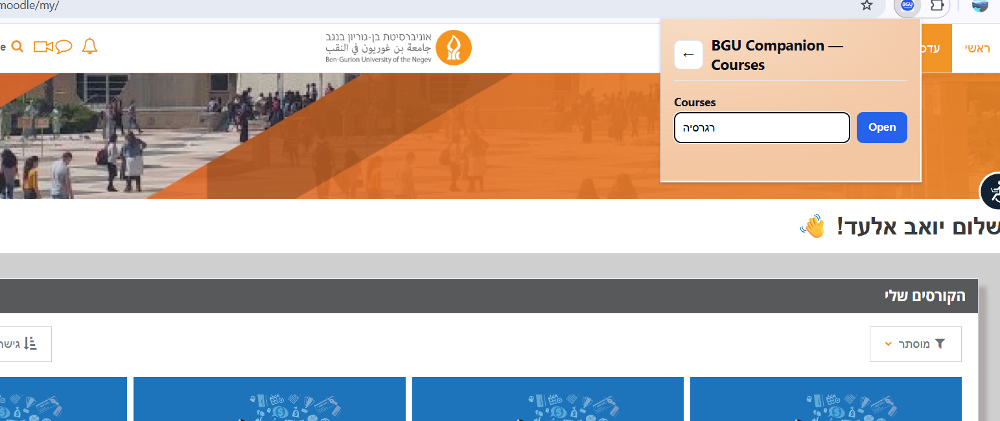
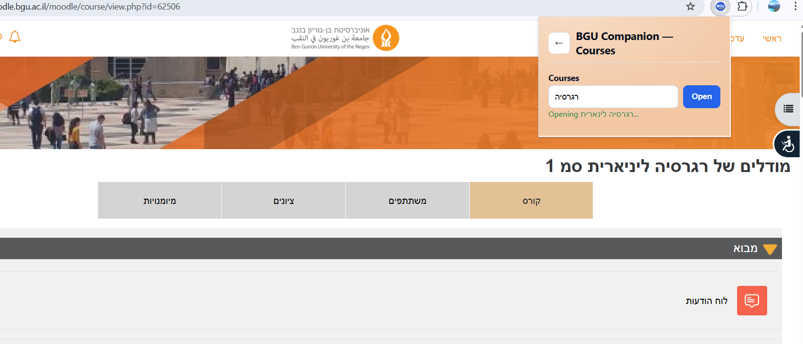

# BGU Companion – Chrome Extension

A productivity-focused Chrome extension designed for BGU students.

BGU Companion centralizes course access, student systems, and login autofill into a single lightweight browser extension.

---

---

## 🚀 Overview

BGU Companion improves daily academic workflow by:

- Instant Moodle course navigation
- Inline course search inside Moodle
- Quick shortcuts to Gezer (Exams) and Student Info systems
- Secure autofill of username and student ID
- Local storage persistence

Built with a focus on security, clean UX, and real student needs.

---

# 🖼 User Interface

## 🔹 Main Popup (Hub)

Central navigation panel providing access to:
- Courses
- Gezer (Tests)
- Student Info
- Settings

---

## 🔹 Course Search Interface

Search courses using partial matching (Hebrew / English supported).

---

## 🔹 Course Opening Feedback

Real-time feedback when navigating to a course.

---

## 🔹 Settings & Course Management

Includes:
- Secure autofill profile setup
- Course CRUD management
- Autofill toggle
- Persistent local storage

Passwords are handled strictly by Chrome Password Manager.

---

# 🔐 Secure Autofill System

The extension autofills:

- Username (before @)
- 9-digit Student ID
- Never touches passwords

### 🔹 Gezer Login Autofill

---

### 🔹 Student Info Portal Autofill

Autofill logic uses heuristic input detection to safely identify ID and username fields.

---

# 🧠 Moodle Inline Enhancement

The extension injects a search bar directly into Moodle pages.

Allows instant course navigation without returning to the popup.

---

## Core Features

### 1. Quick Access Hub (Popup UI)
- Courses search with intelligent matching
- Direct links to:
  - Moodle
  - Gezer (Exams)
  - Student Info system
- Clean multi-view interface

---

### 2. Persistent Course Management
- Local storage of custom course links
- Add / update / delete courses
- Automatic seeding of default BGU courses
- Sorted rendering

---

### 3. Secure Autofill (No Password Storage)
- Autofills:
  - Username (before @)
  - 9-digit student ID
- Works on:
  - Moodle
  - Gezer
  - Student Info portal
- Password handled only by Chrome Password Manager

---

### 4. Inline Moodle Enhancement

Injects a course search bar directly into Moodle pages, allowing instant navigation without leaving the page.

---

## Architecture

- manifest.json – Extension configuration (Manifest V3)
- popup.html / popup.js – Main hub interface
- options.html / options.js – Settings + profile management
- content.js – Autofill logic + Moodle UI injection
- popup.css – UI styling

---

## Technical Highlights

- Chrome Extension Manifest V3
- chrome.storage.local persistence
- Content script DOM analysis
- Heuristic-based input detection for autofill
- Dynamic UI injection into third-party pages
- Event-driven UI state switching

---

## Permissions Used

- tabs
- storage

Used strictly for:
- Opening external systems
- Storing user preferences

---
## Installation

### Option A — Install from ZIP (Recommended)
1. Download the latest release ZIP from the **Releases** section.
2. Extract the ZIP to a folder on your computer.
3. Open Chrome and go to `chrome://extensions/`
4. Enable **Developer mode** (top right).
5. Click **Load unpacked**.
6. Select the extracted folder (the one that contains `manifest.json`).

### Option B — Install from Source (GitHub)
1. Click **Code → Download ZIP** (or clone the repo).
2. Extract the project folder.
3. Go to `chrome://extensions/` → enable **Developer mode**
4. Click **Load unpacked** → select the folder containing `manifest.json`
---
## Privacy & Data

- The extension stores course links and profile preferences locally using `chrome.storage.local`.
- **Passwords are never stored** (Chrome Password Manager handles passwords).
- No data is sent to external servers.

---

## What This Project Demonstrates

- Product-oriented thinking
- Frontend UI development
- Browser API integration
- Secure data handling practices
- DOM inspection and automation logic
- Practical system design for real users

---

## Future Improvements

- Cross-device sync
- Theme customization
- Course grouping
- Analytics dashboard for usage tracking
