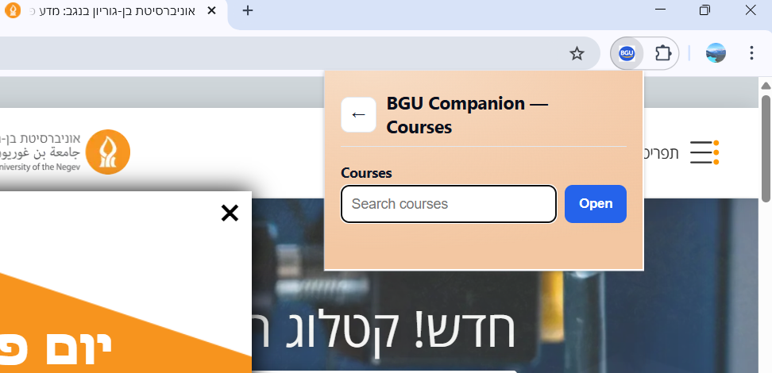
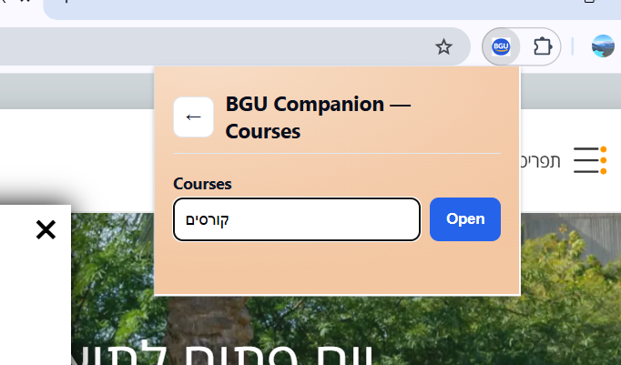
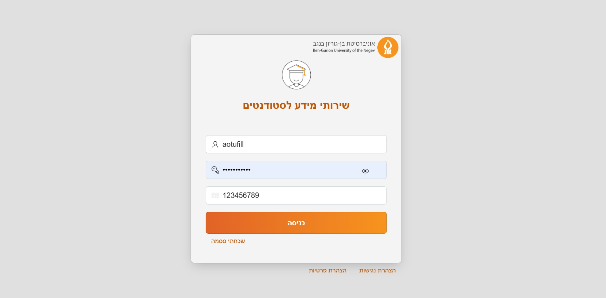

# BGU Companion - Chrome Extension

A productivity-focused Chrome extension for BGU students.

BGU Companion centralizes course access, student systems, and secure login autofill into a single lightweight extension built for daily academic use.

---

---

## Overview

BGU Companion improves the student workflow by providing:

- Fast popup-based navigation to saved courses
- Quick shortcuts to Gezer, Student Info, Portal, and Settings
- A floating save widget for supported BGU pages
- Secure autofill of username and 9-digit student ID
- Persistent local storage for saved pages and profile preferences

The extension never stores passwords. Passwords remain handled only by Chrome Password Manager.

---

## User Interface

## Main Popup

The popup is the main hub for:

- Courses
- Gezer
- Student Info
- Portal
- Settings

---

## Course Search

Search saved courses/pages using partial matching and open them directly from the popup.

---

## Course Opening Feedback

The popup shows immediate feedback when a saved course/page is being opened.

---

## Settings And Course Management

The settings page includes:

- Autofill profile setup
- 9-digit student ID configuration
- Autofill toggle
- Course/page add, update, and delete
- Persistent local storage

The page layout was updated in v1.1 to use the full width more cleanly and avoid the old table overflow behavior.

---

## Secure Autofill

The extension can autofill:

- Username
- 9-digit student ID

It does not store, read, or manage passwords.

### Gezer Autofill

### Student Info Autofill

Autofill uses heuristic field detection to identify the username and ID inputs safely.

---

## New In v1.1

### Floating Save Widget

BGU Companion now injects a compact floating save widget on supported BGU pages.

Behavior:

- `Save` state:
  - Orange
  - Clickable
  - Opens an inline save dialog
- `Saved` state:
  - Green
  - Disabled / non-clickable
  - Shown immediately when the current relevant URL is already stored

The save widget uses a normalized relevant URL, so Moodle pages prefer a cleaner course-level URL when one can be detected.

### Portal Shortcut

The popup now includes a dedicated `פורטל` shortcut:

- `https://portal.bgu.ac.il/public/login`

### Portal Autofill Support

The content script now also runs on:

- `https://portal.bgu.ac.il/*`

This allows the existing username / 9-digit ID autofill flow to work there as well.

---

## Supported Sites

The content script currently runs on:

- `https://moodle.bgu.ac.il/moodle/*`
- `https://gezer1.bgu.ac.il/*`
- `https://bgu4u22.bgu.ac.il/*`
- `https://bgu4u.bgu.ac.il/*`
- `https://portal.bgu.ac.il/*`

Shortcut targets in the popup:

- Gezer: `https://gezer1.bgu.ac.il/meser/hlogin.php`
- Student Info (`מידע אישי`): `https://bgu4u22.bgu.ac.il/apex/10g/r/f_login1004/login_desktop?p_lang=he`
- Portal (`פורטל`): `https://portal.bgu.ac.il/public/login`

---

## Core Features

### 1. Quick Access Popup

- Multi-view popup UI
- Fast saved-course search
- Direct shortcuts to key BGU systems

### 2. Saved Courses / Pages

- Store custom course/page links in `chrome.storage.local`
- Add, update, and delete saved entries
- Keep compatibility with the existing `{ "Name": "URL" }` structure
- Seed default course data when storage is empty

### 3. Secure Autofill

- Autofills username and 9-digit student ID
- Works only on supported hosts
- Never stores passwords

### 4. Floating Save Widget

- Save the current relevant page directly from the page itself
- Suggest a smart page/course name
- Prevent duplicate saves by URL
- Prevent silent overwrite on name collisions

---

## Architecture

- `manifest.json` - extension configuration (Manifest V3)
- `popup.html` / `popup.js` - popup hub and shortcuts
- `options.html` / `options.js` - settings page and saved course management
- `content.js` - autofill logic and floating save widget
- `popup.css` - popup and settings styling
- `courses-data.js` - seeded course data

---

## Technical Highlights

- Chrome Extension Manifest V3
- `chrome.storage.local` persistence
- DOM-based heuristic autofill detection
- Dynamic inline UI injection
- Relevant URL normalization for saving Moodle pages
- Compact state-driven widget behavior

---

## Permissions Used

- `tabs`
- `storage`

Used strictly for:

- Opening external systems and saved pages
- Storing local preferences and saved links

---

## Installation

### Option A - Install From ZIP

1. Download the latest release ZIP from the GitHub Releases section.
2. Extract it to a local folder.
3. Open Chrome and go to `chrome://extensions/`.
4. Enable **Developer mode**.
5. Click **Load unpacked**.
6. Select the folder containing `manifest.json`.

### Option B - Install From Source

1. Clone the repo or download the source ZIP.
2. Extract the project folder.
3. Open `chrome://extensions/`.
4. Enable **Developer mode**.
5. Click **Load unpacked**.
6. Select the folder containing `manifest.json`.

---

## Privacy And Data

- Course/page links are stored locally in `chrome.storage.local`
- Profile preferences are stored locally in `chrome.storage.local`
- Passwords are never stored by the extension
- No user data is sent to external servers

---

## Screenshot Paths For v1.1

Existing screenshots already used in this README:

- `screenshots/popuphome.png`
- `screenshots/popupcourse1.png`
- `screenshots/popupcourse2.png`
- `screenshots/popupsettings.png`
- `screenshots/popupgezer.png`
- `screenshots/popupstudentinfo.png`

Recommended new screenshot file paths for the current version:

- `screenshots/popupportal.png` - popup showing the new `פורטל` button
- `screenshots/savewidget-save.png` - floating widget in orange `Save` state
- `screenshots/savewidget-dialog.png` - inline save dialog opened from the widget
- `screenshots/savewidget-saved.png` - floating widget in green `Saved` state
- `screenshots/portal-autofill.png` - autofill behavior on `portal.bgu.ac.il`
- `screenshots/settings-v11.png` - updated full-width settings layout

You can drop screenshots into those paths and then add them into the README later without changing the repo structure.

---

## What This Project Demonstrates

- Product-oriented thinking
- Frontend UI development
- Chrome extension API usage
- Secure handling of student login flows
- DOM inspection and heuristic automation
- Practical UX improvements for real users

---

## Future Improvements

- Cross-device sync
- Course grouping
- Better page labeling for non-Moodle systems
- Optional screenshot refresh for the new v1.1 UI
