# BGU Companion

A Chrome extension built for Ben-Gurion University students who want faster access to the systems they use every day.

BGU Companion brings saved course navigation, quick links to student systems, secure autofill for username and 9-digit ID, and an on-page save widget into one lightweight extension. The goal is simple: remove repetitive clicks, reduce friction between BGU systems, and make routine academic browsing feel faster and cleaner.


---

## Why This Extension Exists

Students constantly jump between Moodle, Gezer, Student Info, and the BGU portal. In practice, that usually means:

- searching for the same courses again and again
- manually reopening system pages from bookmarks or old tabs
- retyping the same username and 9-digit ID on login pages
- losing useful course links because saving them is inconvenient

BGU Companion solves those problems with a focused set of features that are designed around real daily use, not around a generic browser extension template.

---

## What BGU Companion Does

- Opens saved courses and pages directly from a compact popup
- Provides quick shortcuts to Gezer, Student Info, the student portal, and settings
- Stores course/page links locally in a simple name-to-URL structure
- Autofills username and 9-digit student ID on supported BGU systems
- Adds a floating save widget to supported pages so links can be saved directly from the page
- Detects when a page is already saved and reflects that state immediately

Passwords are never stored by the extension. Chrome Password Manager remains the only password handler.

---

## Product Tour

## Main Popup
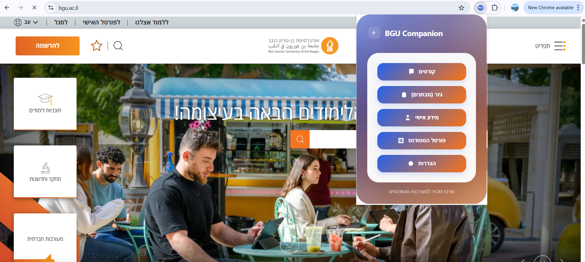

The popup is the main entry point to the extension. It is designed as a compact hub that gives immediate access to the most common BGU destinations:

- Courses
- Gezer
- Student Info
- Student Portal
- Settings

The popup was visually refreshed in v1.1 with a more polished rounded layout, softer chrome, updated icons, and a cleaner blue/orange visual identity.

---

## Course Search In The Popup
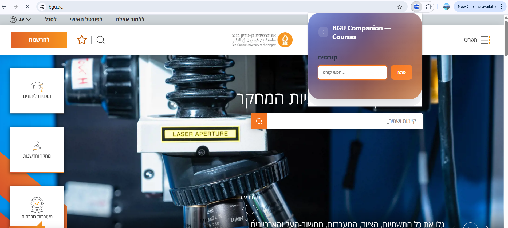

The popup includes a dedicated course search view for fast access to saved pages. Students can type part of a course name and open the saved link immediately without manually browsing Moodle menus.

This is especially useful when:

- a course has already been saved once and just needs to be reopened
- the same course is used every week
- a student wants one consistent place to open saved academic pages from

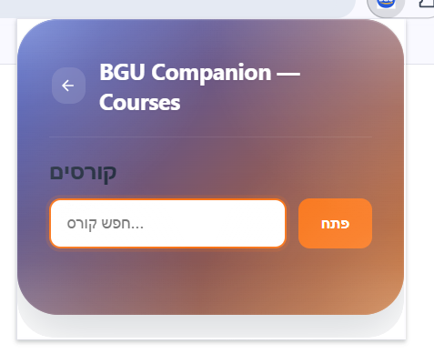

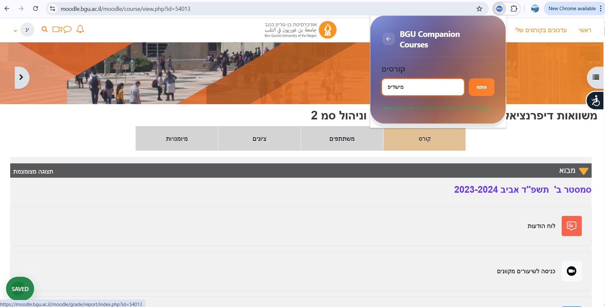


---

## Settings And Course Management
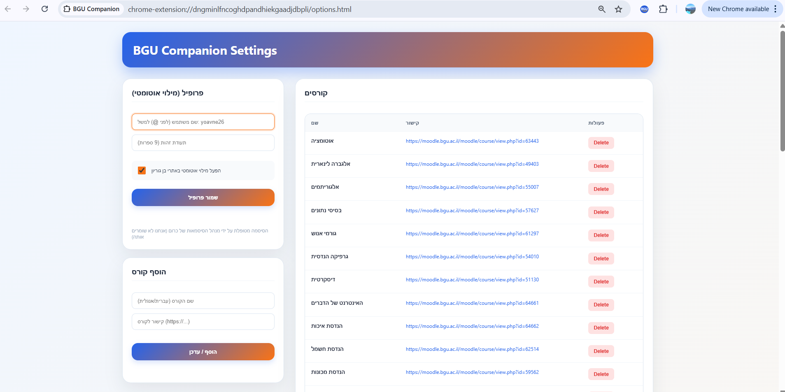

The settings page is the control center for the extension. It includes two major responsibilities:

1. Managing the autofill profile
2. Managing saved courses/pages

Students can configure:

- username
- 9-digit student ID
- autofill enabled or disabled

They can also:

- add a new course/page manually
- update an existing saved entry
- delete saved links they no longer need
- review all saved links in one place

The settings page layout was redesigned to use the full page width more effectively and to avoid the earlier horizontal overflow issues that made the courses table harder to use.


---

## Floating Save Widget

One of the main additions in v1.1 is the floating save widget that appears directly on supported BGU pages.

Instead of opening settings and copying a URL manually, the user can save the current page from the page itself.

### Save State
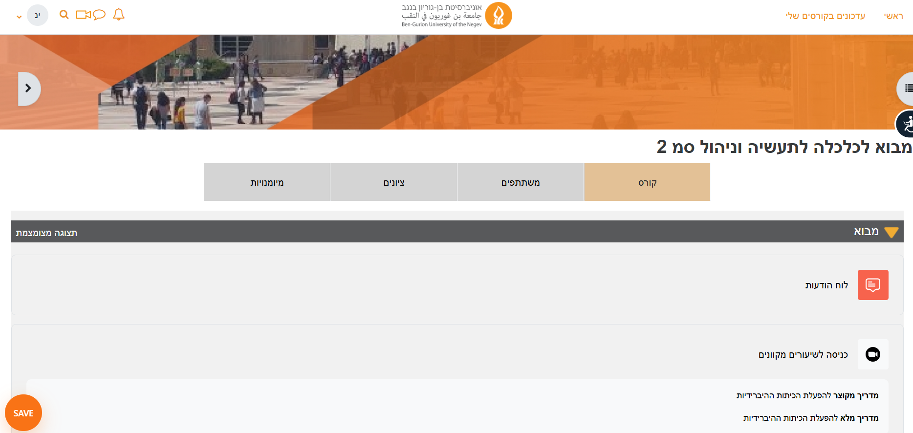

When the current relevant page is not yet stored, the widget appears in its active save state:

- orange button
- clickable
- visually active

This tells the user that the current page can be added to their saved list immediately.

### Save Dialog
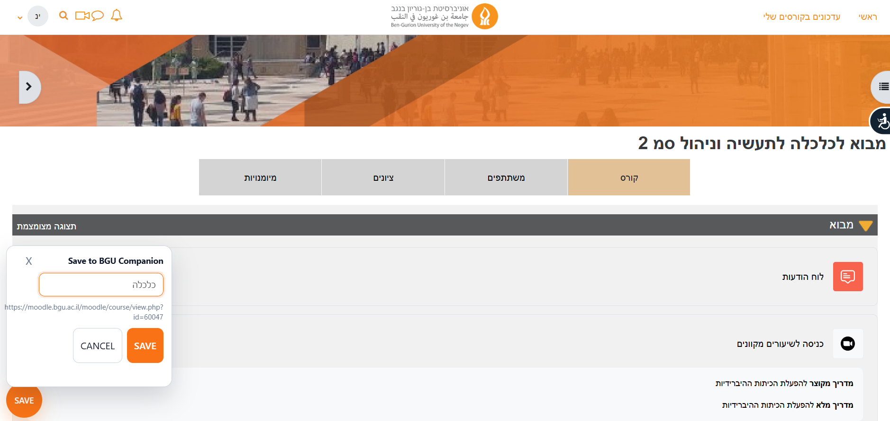

When the user clicks the save button, the extension opens a compact inline dialog that:

- suggests a useful course/page name
- shows the URL that will be stored
- lets the user save without leaving the page

The dialog is intentionally small and non-intrusive so it does not break the browsing flow.

### Saved State
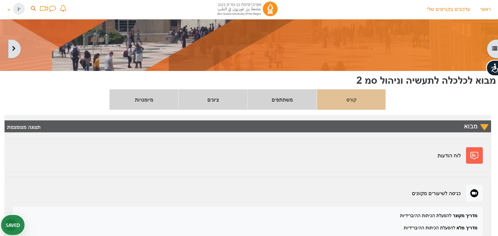

If the current relevant URL already exists in storage, the widget changes immediately to:

- green
- marked as `Saved`
- non-clickable

This removes ambiguity and prevents duplicate saving by URL.

---

## Secure Autofill

BGU Companion autofills only the fields that are repetitive and safe to handle locally:

- username
- 9-digit student ID

It never stores passwords and it never tries to manage credentials outside the browser's own password manager.

### Student Info Autofill
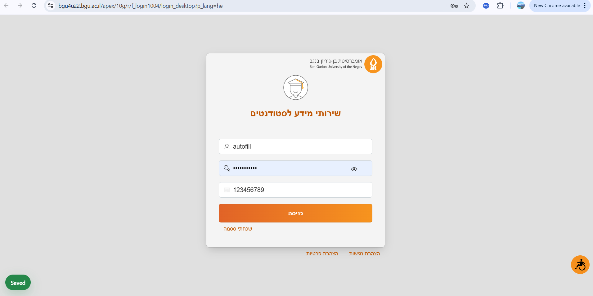

On supported Student Info pages, the extension can populate the username and ID fields automatically when the user has configured their profile in settings.


### Portal Autofill
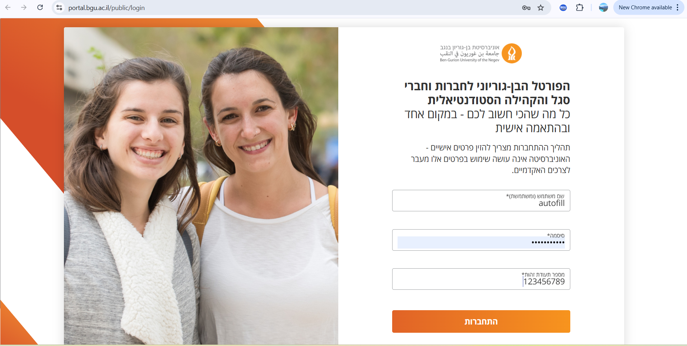

The student portal is now part of the supported autofill flow as well. This extends the extension beyond Moodle and Gezer into another frequently used BGU system.

### Gezer Autofill
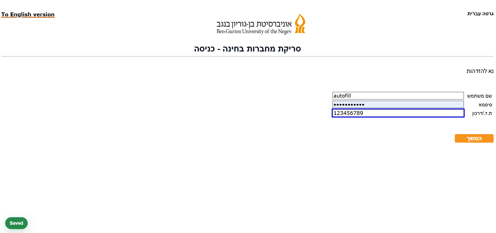

Gezer remains part of the secure autofill workflow, allowing students to move through exam-related pages faster without storing sensitive password data in the extension.

### Autofill Detection Model

The autofill logic uses heuristic field detection rather than site-specific hardcoding only. In practice, that means the extension looks for:

- common username field patterns
- likely ID field patterns
- labels, placeholders, names, IDs, and other hints around inputs

This makes the feature more adaptable across different BGU pages while staying limited to username and ID only.

---

## How Saving Works

Saved pages are stored in `chrome.storage.local` using a simple structure:

```json
{
  "Course Name": "https://example-url"
}
```

That design keeps the extension easy to reason about and fully compatible across popup search, settings, and the floating save widget.

When saving from Moodle, BGU Companion tries to detect a better course-level URL instead of blindly storing the exact current nested page. This matters because students often browse inside a course and still want to save the course entry point rather than a temporary sub-page.

Duplicate handling is also deliberate:

- duplicate URLs are blocked
- existing names pointing to different URLs are not silently overwritten
- saved state is reflected visually as soon as the extension detects the page is already stored

---

## Supported Systems

The content script currently runs on the following hosts:

- `https://moodle.bgu.ac.il/moodle/*`
- `https://gezer1.bgu.ac.il/*`
- `https://bgu4u22.bgu.ac.il/*`
- `https://bgu4u.bgu.ac.il/*`
- `https://portal.bgu.ac.il/*`

The popup also includes direct shortcuts to:

- Gezer
- Student Info
- Student Portal
- Settings

Shortcut targets:

- Gezer: `https://gezer1.bgu.ac.il/meser/hlogin.php`
- Student Info: `https://bgu4u22.bgu.ac.il/apex/10g/r/f_login1004/login_desktop?p_lang=he`
- Student Portal: `https://portal.bgu.ac.il/public/login`

---

## Security And Privacy

Security was one of the main design constraints for the extension.

BGU Companion:

- stores course/page links locally using `chrome.storage.local`
- stores autofill profile data locally using `chrome.storage.local`
- never stores passwords
- never sends user data to external servers
- relies on Chrome Password Manager for password handling

This keeps the extension useful without taking ownership of the most sensitive part of the login flow.

---

## Technical Overview

Core files:

- `manifest.json` - extension configuration, permissions, and content script registration
- `popup.html` / `popup.js` - popup interface, course search, and quick shortcuts
- `options.html` / `options.js` - settings page, profile management, and saved course management
- `content.js` - autofill logic and floating save widget behavior
- `popup.css` - popup and settings styling
- `courses-data.js` - seeded default course data

Technical highlights:

- Chrome Extension Manifest V3
- `chrome.storage.local` persistence
- DOM-based heuristic input detection
- dynamic on-page UI injection
- state-based save widget behavior
- Moodle-aware relevant URL normalization

---

## Installation

### Install From Source

1. Download the project or clone the repository.
2. Open Chrome and go to `chrome://extensions/`.
3. Enable **Developer mode**.
4. Click **Load unpacked**.
5. Select the project folder that contains `manifest.json`.

### Install From Release ZIP

1. Download the latest release ZIP from GitHub Releases.
2. Extract it to a local folder.
3. Open `chrome://extensions/`.
4. Enable **Developer mode**.
5. Click **Load unpacked**.
6. Select the extracted folder containing `manifest.json`.

---


## Project Value

This project demonstrates:

- product-oriented UX thinking
- Chrome extension architecture
- browser API integration
- safe handling of login-related workflows
- pragmatic automation with real user constraints
- interface design for daily student productivity


